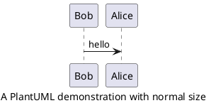

# Plantuml diagram

This `pandoc` filter interprets raw `plantuml` code and paste corresponding generated image at same location.

## How-to

Just paste your `plantuml` code block:

Two elements are extracted by the filter:

* The **caption** attribute is removed but used as the generated figure's caption
* The **scale** attribute is used to resize the generated figure

## Limitation

The **scale** attribute's value should a floating point value.
`1.0` is equivalent to `100%` of the page width.

## Issue

The image resizing does not work properly for `HTML`.
